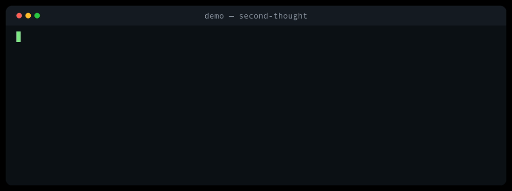

# Second Thought ⏱️

[](https://github.com/rodriveiga01/second-thought/actions/workflows/test.yml)

The most expensive keystroke on your keyboard is **Enter**. Every engineer has
a story about it — `rm -rf` one folder too high, a localhost command landing on
prod, a force-push wiping a teammate's afternoon. Reviews, CI, and backups help
*around* that moment. Nothing watches the moment itself.

Second Thought sits in that moment: a terminal seatbelt judging each command
**before** it runs — green go, yellow stop-and-read, red didn't run. A calibrated
AI judge answers multiple-choice questions about the command (*dangerous? which
kind? how sure?*) instead of generating text, so it can't hallucinate commands
back at you. Boring commands never leave your laptop; scary ones cost about a
millionth of a dollar. Whatever the judge can't reach fails open — and admits it.

[](video/reels/all-five.mp4)

*Five attacks in 28 seconds, escalating in stakes and sneakiness. Loops above;
click for full quality. New to terminals? Start with [`docs/BEGINNERS.md`](docs/BEGINNERS.md).*

## Quickstart

```sh
git clone https://github.com/rodriveiga01/second-thought.git && cd second-thought
pip install -e .              # or skip install: ./second-thought works too
second-thought demo           # the 12-scenario drill — $0, nothing runs
second-thought test           # self-test, then:
second-thought setup --write  # protection on (one ~/.zshrc line, backup first)
```

Open a new terminal and every folder you `cd` into is covered — the hook lives
in your shell, not in any repo. For real judgment, add one free API key
(`console.typesafe.ai → Settings → Keys`) to your Mac Keychain:

```sh
security add-generic-password -s second-thought-jev -a "$USER" -w
```

Without a key you get a deterministic mock: great for demos, honestly labeled
rehearsal — not protection. Pause anytime with `export SECOND_THOUGHT_OFF=1`.

## A normal day

Most commands pass silently (~1ms, no network). When one gets flagged:

```text
$ git push --force origin main
Warning — this looks risky. STOP — this overwrites work your whole team shares.
```

Warnings still run; blocks don't. Sure it's wrong — folder, branch and database
name checked? — type `YES` and it runs exactly once. But warnings are
stop-signs and **YES is not muscle memory**. Everything judged lands in a local
diary (`second-thought diary`) — your audit trail for "what happened Friday."

Gating an AI agent's shell calls instead? [`integrations/`](integrations/) has a
ready-made hook plus the pattern: exit codes as contract, never fail open.

## How it works

```
typed command → normalize → redact → boring? (allow, $0)
  → build_state (~400 tokens) → judge: live Jev or mock → gate → receipt
```

Secrets are redacted *before* judging or logging. Gates (P>0.85 + conf>0.8 for
block, P>0.6 warn) favor precision and are never fitted to anecdotes. Any shell
operator forces full judgment; bare `YES` with nothing pending can never execute
(on macOS it resolves to `/usr/bin/yes` — guarded). Verified by 19 tests, the
drill, and interactive shell tests; contributing agents read [`AGENTS.md`](AGENTS.md).

| Job | Does |
|---|---|
| `test` / `demo` / `check "cmd"` | Self-test · drill · judge one string (never runs it) |
| `diary` / `clean` | Read / rotate the receipt log |
| `setup` / `remove` | Install / remove the hook (asks first) |

## FAQ

**Slow my shell?** ~1ms on everyday commands; a beat on scary ones — that's the point.
**Phone home?** Only live judgments leave the laptop (redacted). Keyless: zero network. Ever.
**Blocks something legit?** `YES`, once, deliberately. If it's chronic, open an issue with the receipt line.

A seatbelt, not a replacement for backups, least-privilege, or prod access controls.
Keyless mock knows 12 scenarios; everything else waves through by design.

## License

MIT — see [LICENSE](LICENSE).
